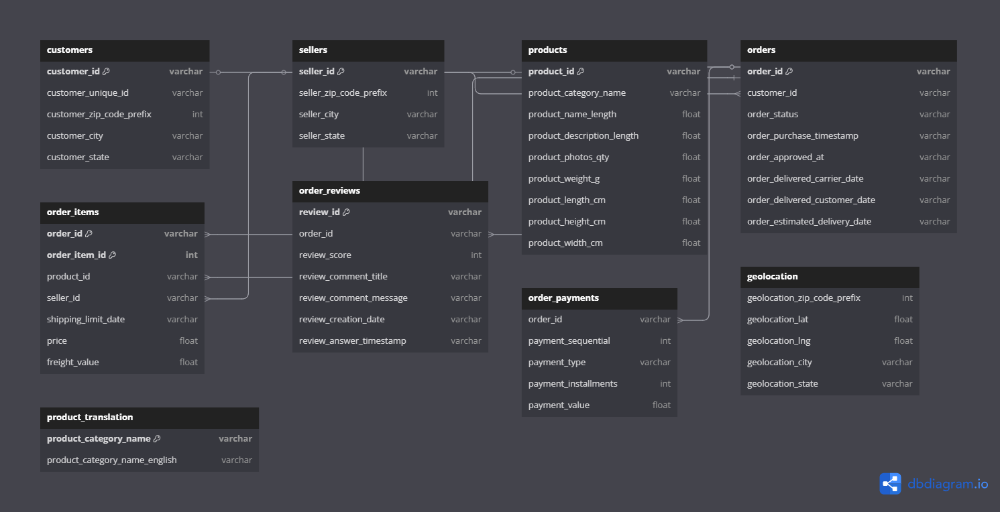

#  Projeto: Análise de Dados do E-commerce Brasileiro (Olist)

Este repositório traz a solução completa para o **desafio técnico do Programa Trainee triggo.ai de Excelência em Engenharia de Dados e DataOps 2025**. 

Aqui você encontrará desde a preparação dos dados até a criação de dashboards interativos com os dados públicos da Olist, uma plataforma de e-commerce brasileira.

---

##  Objetivo

O foco deste projeto é simular os desafios enfrentados por um Engenheiro de Dados na prática: entender os dados, limpá-los, relacioná-los e extrair insights valiosos.

---

##  Estrutura do Repositório

```bash
.
├── dashboards/ #-> Dahsboards interativos
│   ├── app_dash1_evolucao_vendas.py
│   ├── app_dash2_mapa_estado.py
│   ├── app_dash3_avaliacao_entrega.py
│   ├── app_dash4_vendedores.py
│   └── geojson/
│       └── brazil_states.geojson
├── data/
│   ├── raw/                  #-> Dados brutos (CSVs da Olist)
│   └── processed/            #-> Dados tratados e banco SQLite gerado
│       └── olist_ecommerce.db
├── notebooks/
│   ├── olist_analysis.ipynb  #-> Notebook com todo o raciocínio documentado
│   └──outputs/ #-> Gráficos estáticos
├── src/
│   └── data_preprocessing.py
├── docs/ #-> MER - Modelo de Entidade e Relacionamento
│   └── database_schema.png
├── requirements.txt #-> Bibliotecas utilizadas no projeto
└── README.md
```

---

##  Tecnologias e Bibliotecas Utilizadas

###  Linguagem e ferramentas principais

* **Python 3.11**
* **Pandas, NumPy**
* **SQLite3 + SQL**
  
###  Visualização de Dados

* **Matplotlib, Seaborn**
* **Plotly Dash + Dash Bootstrap Components**

###  Machine Learning

* **Scikit-learn**

###  Recursos extras

* **GeoJSON dos estados brasileiros**
* **DB Diagram**

###  Dependências (requirements.txt)

```txt
pandas==2.2.2
numpy==1.26.4
matplotlib==3.8.4
seaborn==0.13.2
scikit-learn==1.4.2
dash==2.16.1
dash-bootstrap-components==1.5.0
```
---

##  Como Executar o Projeto

1. **Clone o repositório:**

```bash
git clone https://github.com/EdYass/desafio_data_engineer_triggo_2025.git
cd desafio_data_engineer_triggo_2025
code .
```
2. **Python**

Caso você não tenha Pyhton 3.11 instalado na sua máquina
> Acesse o site oficial: https://www.python.org/downloads/release/python-3110/

3. **Crie e ative um ambiente virtual:**

```bash
python -m venv venv
./venv/Scripts/activate 
```

4. **Instale as dependências:**

```bash
pip install -r requirements.txt
```

*OBS:* Caso ao executar o comando a cima apresentar o seguinte erro:  

```bash
Installing build dependencies ... error
error: subprocess-exited-with-error
```
Veja se a versão do Pyhton está correta. Caso esteja, apenas atualize o pip para versão mais recente (25.1.1):

```bash
python.exe -m pip install --upgrade pip
```

5. **Gere o banco de dados executando o notebook:**

Abra `notebooks/olist_analysis.ipynb` e clique em **"Run All"**.

*OBS:* Caso seja necessário para avaliação, delete os arquivos e *processed* e *outputs*, pois eles serão recriados ao executar o passo acima.

6. **Execute os dashboards (em terminais separados):**

```bash
python dashboards/app_dash1_evolucao_vendas.py
python dashboards/app_dash2_mapa_estado.py
python dashboards/app_dash3_avaliacao_entrega.py
python dashboards/app_dash4_vendedores.py
```

Acesse `http://127.0.0.1:8050` no navegador.

---

## Modelo Relacional do Banco



Criado com [DB Diagram](https://dbdiagram.io).

---

##  Etapas Realizadas

### 1.  Preparação dos Dados

* Importação, limpeza, normalização e modelagem relacional em SQLite

### 2.  Análise Exploratória

* Volume de pedidos, tempo de entrega, valor do frete vs. distância, etc.

### 3.  Soluções de Negócio

* Clientes recorrentes, predição de atrasos, segmentação e satisfação

### 4.  Visualizações

* Dashboards interativos com foco em clareza, performance e usabilidade
  
---

##  Dashboards Interativos Criados

| Dashboard                        | Descrição                                                          |
| -------------------------------- | ------------------------------------------------------------------ |
| `app_dash1_evolucao_vendas.py`   | Evolução de pedidos por mês com filtros por estado e categoria     |
| `app_dash2_mapa_estado.py`       | Mapa de calor com a concentração de vendas por estado              |
| `app_dash3_avaliacao_entrega.py` | Relação entre tempo de entrega e avaliação do cliente              |
| `app_dash4_vendedores.py`        | Comparativo entre vendedores (nota, tempo médio, volume de pedidos)|

---

##  Observações Finais

* Raciocínio documentado passo a passo no notebook `olist_analysis.ipynb`
* SQL usado de forma otimizada para consultas complexas

---

##  Referências

* [Olist Dataset - Kaggle](https://www.kaggle.com/datasets/olistbr/brazilian-ecommerce)
* [DB Diagram](https://dbdiagram.io)
* [Plotly Dash Docs](https://dash.plotly.com/)
* [GeoJSON](https://raw.githubusercontent.com/codeforamerica/click_that_hood/master/public/data/brazil-states.geojson)

---
##  Autor

**Edwin Jun Iassanori Yassunaga**  
Desenvolvido para o Desafio Técnico — *Programa Trainee triggo.ai 2025*
